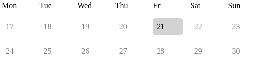

# nextweek

## vue3 component

pick up date on calendar view.

calendar shows current and next week 2x7.



```
you can highlights and picks date via 'v-model'
<Nextweek v-model="value" :display="display" :start="start"/>

// 'start' puts monday(1) on first column.
// 'display' shows day on first row.
// and show next week.
// i.e
// mon*   tue   wed   thu   fri   sat   sun
// 17     18    19    20    21    22*   23
// 24     25    26    27    28    29    30
display: new Date('2023-07-22T12:00:00Z'),
start: 1, 

// highlights and represents value on its
// i.e
// mon    tue   wed   thu   fri   sat   sun
// 17     18    19    20    21*   22    23
// 24     25    26    27    28    29    30
value: new Date('2023-07-21T00:00:00Z'),
```

## Project setup
```
npm install
```

### Compiles and hot-reloads for development
```
npm run serve
```

### Compiles and minifies for production
```
npm run build
```

### Customize configuration
See [Configuration Reference](https://cli.vuejs.org/config/).